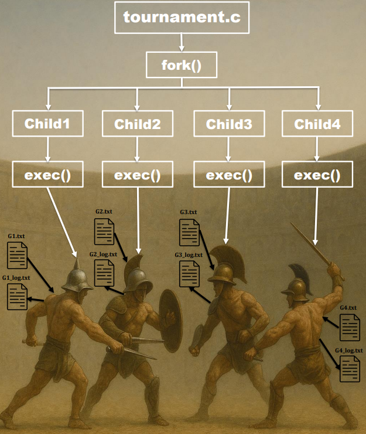

# Gladiator Tournament

## Introduction

In this assignment, you are tasked with implementing a tournament between gladiators. Each gladiator is represented as a process, and their fight is executed in a series of forked child processes. The tournament will declare the winner based on the last gladiator standing after the sequence of battles.

The project will use various system calls and concepts, including `fork()`, `exec()`, `wait()`, file descriptors, and process management, to simulate the tournament. Additionally, you'll be working with logging to file, where each gladiator logs their actions, health, and attack values.

## How is this gonna work

**Tournament Progression**:
1. The `tournament.c` program starts by forking four gladiators.
2. Each gladiator’s process is executed with `exec()`, running the `gladiator.c` program.
3. Each gladiator fights their opponents in order, deducting health as they go.
4. Once a gladiator’s health reaches zero or below, they "fall" and stop fighting.
5. The `tournament.c` program waits for all gladiators to finish with `wait()` or `waitpid()` and declares the winner based on the last gladiator standing.


## Task Overview

### 1. Tournament Setup

The tournament consists of four gladiators. Each gladiator has a file describing their initial stats and the opponents they will fight in order. You will write a `tournament.c` program that will:
- Define the gladiators and their matching files:
```c
char* gladiator_names[NUM_GLADIATORS] = {"Maximus", "Lucius", "Commodus", "Spartacus"};
char* gladiator_files[NUM_GLADIATORS] = {"G1", "G2", "G3", "G4"};
```
- Fork four child processes (one for each gladiator).
- Use `exec()` to launch each gladiator as a separate process with the `gladiator` executable.
    > **Tip:** Pass the matching gladiator file name as an argument :)
- Wait for all child processes to complete using `wait()` or `waitpid()`.
- Determine the winner based on the gladiator who remains alive last, i.e., the one whose process terminates last.

### 2. Gladiator Stats

Each gladiator is represented by a text file (`G1.txt`, `G2.txt`, etc.) that contains their stats:

```
Health, Attack, Opponent1, Opponent2, Opponent3
```

Where:
- `Health` is the gladiator's starting health.
- `Attack` is the gladiator's attack power.
- `Opponent1`, `Opponent2`, and `Opponent3` represent the gladiators that this gladiator will fight in sequence.

The gladiator will attack each opponent in the specified order, deducting the opponent's attack power from the gladiator's health until it reaches zero or below.

- **Example**:
    ```
    1500, 100, 3, 2, 4
    ```

    Where:
    - `1500` is the gladiator’s health.
    - `100` is the gladiator’s attack power.
    - `3, 2, 4` represent the gladiators he will fight (i.e., gladiator 3 first, gladiator 2 second, and gladiator 4 last - and loop over it until he dies).

### 3. Gladiator Fight Simulation

Each gladiator will:
- Read their stats from their respective file (`Maximus => G1.txt`, `Lucius  => G2.txt`, etc.).
- Fight the three opponents in the order specified in the file.
- Deduct its self health based on the opponent's attack power.
- Log their actions and health status into a log file (`G1_log.txt`, `G2_log.txt`, etc.).
- Keep fighting (in the same order) until health is not positive.
- After a battle (when health is not positive), the process will exit with status 0.

### 4. Logging and Quotes

For a more dramatic effect, each gladiator's log file should contain:
- A record of each fight with the opponent's attack power and the gladiator's remaining health.
- A final message when the gladiator is defeated.

Each gladiator's log should look like:

```
Gladiator process started. 1234: 
Facing opponent 3... Taking 90 damage
Are you not entertained? Remaining health: 1410
Facing opponent 2... Taking 100 damage
Are you not entertained? Remaining health: 1310
Facing opponent 4... Taking 110 damage
Are you not entertained? Remaining health: 1200
...
...
Facing opponent 3... Taking 90 damage
Are you not entertained? Remaining health: 70
Facing opponent 2... Taking 100 damage
The gladiator has fallen... Final health: -30
```
> **Note**:  
> **MAKE SURE THAT THE LOG FILE IS CREATED WITH THE RIGHT DATA, IT WILL BE CHECKED**

### 5. Determining the Winner

The winner is determined based on the last gladiator who remains alive. This will be the gladiator whose process exits last. The tournament program will print the winner’s name in the following format:

```
The gods have spoken, the winner of the tournament is [gladiator_name]!
```
> The winner message might not be deterministic. If we decide to check it, we'll choose numbers that guarantee a deterministic outcome (like 1300000 health...)

## Running example
```sh
omer@Omer:~/uni/os/targilim/2025B/ex2/part1$ gcc -o tournament tournament.c
omer@Omer:~/uni/os/targilim/2025B/ex2/part1$ gcc -o gladiator gladiator.c
omer@Omer:~/uni/os/targilim/2025B/ex2/part1$ ./tournament
The gods have spoken, the winner of the tournament is Lucius!
```

## Submission Guidelines

- Submit **only** this following files:
  1. `tournament.c`: The main tournament program.
  2. `gladiator.c`: The gladiator simulation program.

## More things & hints
- You don't need at any point of this assignment to write to the G{i}.txt files.
- **You must name the gladiator executable `gladiator` and call it via exec**.
- Use `fork()` to create child processes for each gladiator.
- Use `exec()` to execute the gladiator fight program (`gladiator.c`) in each child process, you cant use `system()`.
- Use `waitpid()` or `wait()` to wait for each gladiator to finish their fight.
- Make sure the tournament program waits for all processes to complete before declaring the winner.
- Ensure that each gladiator's log file is created and updated during the battle.


## To Make Your Life Easier
- I recommend using `fscanf` for parsing the `G_{i}.txt` files (in the `gladiator.c` file)
- Example for inserting data into the log files (in the `gladiator.c` file):
```c
//print here the pid as I mentioned
while (health > 0) {
    for (int i = 0; i < 3; i++) {
        int opponent_attack = get_opponent_attack(opponents[i]);
        fprintf(logFile, "Facing opponent %d... Taking %d damage\n", opponents[i], opponent_attack);
        health -= opponent_attack;
        if (health > 0) {
            fprintf(logFile, "Are you not entertained? Remaining health: %d\n", health);
        } else {
            fprintf(logFile, "The gladiator has fallen... Final health: %d\n", health);
            break;
        }
    }
}
```
---

Good luck!
